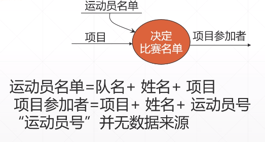

# 改进数据流图 \(DFD图\)

## 改进数据流图 \(DFD图\)

* **主要工作有三个方面**
  * **一. 检查正确性**
  * **二. 提高易理解性**
  * **三. 重新分解**

### 一. 检查正确性

* 分析员可以从以下几个角度来检查 DFD 的正确性:
  * **数据守恒**
  * **数据存储的使用**
  * **父图和子图的平衡**

#### 数据守恒

**`数据 不守恒`**的情况有**两种**:

1. 某个加工输出的数据并无相应的数据来源,  可能是某些数据流被**`遗漏`**了.  

   

2.  一个加工的输入并没有用到,  这不一定是错误.  可与用户进一步讨论, 是否属于 **`多余`**的数据流.  

#### 数据存储的使用

判断:  是否存在 "**`只读不写"`** 或  "**`只写不读`**" 的数据存储.  \( **注意在`所有的` DFD中检查**\).

### 二. 提高易理解性

* 简化加工之间的联系
* 注意分解的均匀
* 适当的命名

#### 简化加工之间的联系

应**`尽量减少`**加工之间输入输出数据流的**`数目`**. 因为加工之间的数据流越少, 各个加工的功能就越相对独立. 

#### 分解的均匀

**即图中各个部分不均匀.**

一张图中, 如果某些加工已是 **`基本加工(细节),`**  而**`另一些`** 加工还可进一步分解成 **`三,四 层,`** 则应考虑重新分解.

#### 适当的命名

* 名字的意义要明确, 容易理解.
* 如果难以为 DFD 图中的成分 \(数据流, 加工等\) 命名, 往往说明分解不当, 可考虑重新分解.

### 三. 重新分解

在画第N层时意识到在`第 N-1 层` 或 `第N-2层` 所犯的错误,  此时就需要对 `第N-1 层,` 第N-2 层 作 **`重新分解.`**

#### 重新分解的做法  有一下八个步骤

1. 把需要的重新分解的某张图的所有子图连接成一张.

2. 把图分成几部分,  使各个部分之间的联系最少.   , \(把图中的加工重新划分\)

3. 重新建立父图, 即把 **第2步** 所得的每一部分画成一个圆, 而各部分之间的联系就是加工之间的界面.

4. 重新建立个各张子图,  这只需把 **第2步** 所得的图按各部分的**边界剪开即可.**

5. 为所有的加工重新命名和编号     \(重新建立父图并编号\)

### 检查数据流图的原则

1. 数据流图上所有图形符号 **`只限于`** 前述 **`四种`** 基本图形元素.
2. 数据流图的主图 **`必须包括`** 前述四种基本元素, 缺一不可.
3. 数据流图的主图上的数据流必须 封闭在外部实体之间.
4. 每个加工**`至少有`**一个输入数据流和一个输入数据流.
5. 在数据流图中, 需**`按层给加工框编号`**. 编号表名该加工所处层次及上下层的亲子关系.
6. 规定任何一个数据流子图必须与它上一层的一个加工对应,  两者的数据数据流和输出数据流必须一致. **`此即父图与子图的平衡`**.
7. 图上每个元素都必须**`有名字`**.
8. 数据流图中不可夹带**`控制流`**.
9. 初画时可以**`忽略琐碎的细节`**, 以集中经历于主要数据流.

### 功能建模 -- 编写数据字典

编写数据字典, 写出系统需求规格说明书, 提交审查, 并编写测试验收计划, 编写初步的用户手册概要.

主要是根据数据库的规则来建模, 要考虑系统中所有存在的内容, 编码和建模.

