# 软件工程

## 软件工程简介

* **软件工程:**
  * `软件工程学,是指导计算机软件`**`开发和维护`**`的工程学科. 包括`**`技术方法, 工具, 管理`**`等内容`
* 掌握软件开发和维护的一般**`思想, 方法, 工具;`**
* **`强调工程化, 规范化, 系统化;`**
* **`系统分析人员, 系统设计人员 必读科目;`**

### 软件的概念, 特点和分类

#### 软件的概念  :     软件 = 程序+ 数据+ 文档

* **软件**
  * `是计算机系统中与硬件相互依存的另一部分, 它是`**`包括程序, 数据及其相关文档的完整集合`**`;`
* **程序**
  * `是按事先设计的`**`功能和性能`**`要求执行的`**`指令序列`**`;`
* **数据**
  * `是使程序能`**`正常操纵信息`**`的`**`数据结构`**`;`
* **文档**
  * `是与程序`**`开发, 维护 和使用有关的图文材料`**`;`

#### 

#### 软件的特点

* 软件是一种**`逻辑实体,`** 而不是具体的物理实体. 因此, 它具有**`抽象性`**;
* 软件的产生与硬件不同.   
  * **`软件开发没有明显制造过程, 对软件的质量控制, 必须立足于软件开发方面.`**
* 在软件运行和使用期间,  没有像硬件那样的**`磨损, 老化问题;`**
* 软件的开发和运行往往受到**`计算机系统的限制`**, 对计算机系统有不同程度的依赖性;
* 迄今为止,  软件的开发尚未完全摆脱**`手工艺`**的方式;
* 软件本身是**复杂**的;
* 软件的成本相当**昂贵**;
* 相当多的软件工作 涉及到**社会因素**;

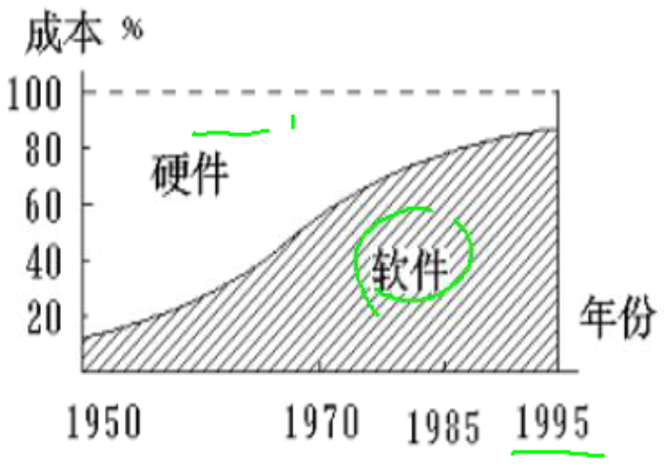

#### 软件的分类

* **按软件的功能划分:**
  * 系统软件, 支撑软件, 应用软件;
* **按软件规模划分:**
  * 微型,  小型, 中型,  大型, 超大型软件
* **按软件的工作方式划分:**
  * 实时软件,  分时软件,  交互式软件,  批处理软件
* **按服务对象划分:**
  * 项目软件\(为用户定制\),  产品软件\(面向特定的客户开发\)
* **按销售方式划分:**
  * **订单软件\(已签订合同\),  非订单软件\(未签订合同\)**

### 软件的发展

#### 软件的发展

**计算机软件发展分 三个时期:**

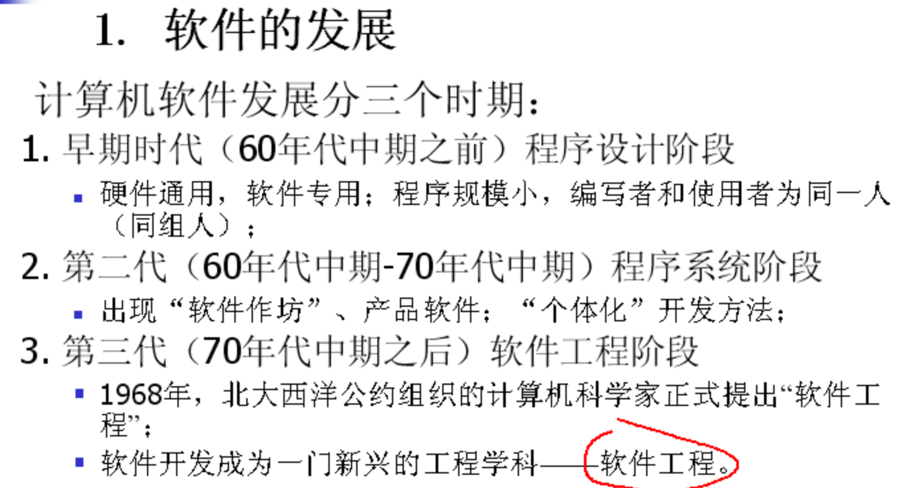

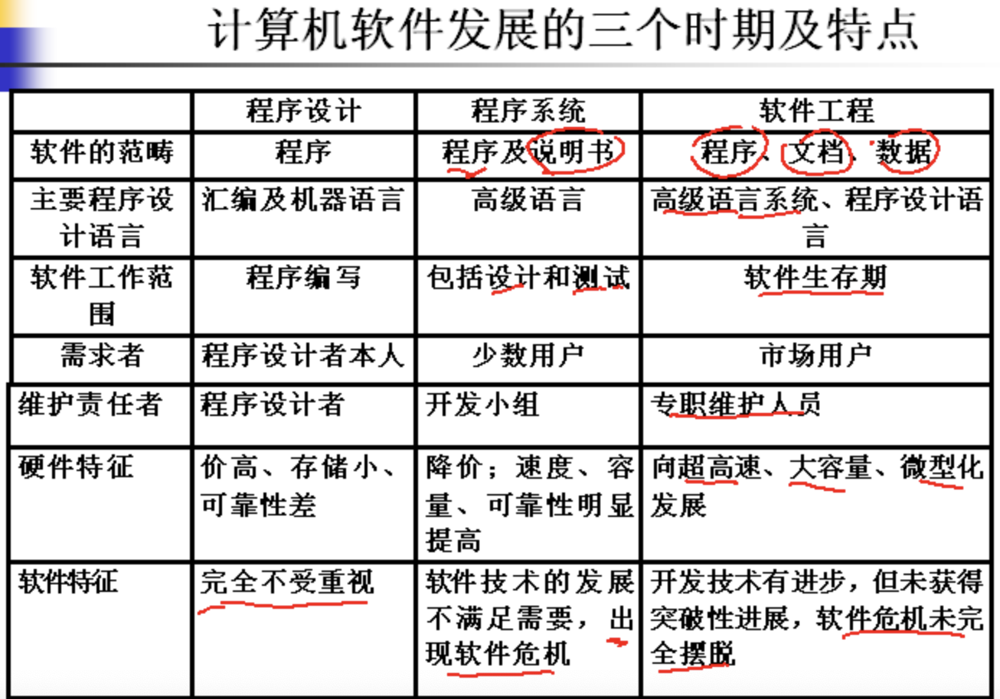

### 软件危机

**软件危机 `是指在计算机软件的开发和维护过程中遇到一系列严重问题.`**

主要是两个问题:

1. **如何开发软件.  满足对软件日益增长的需求.**
2. **如何维护数量不断膨胀的已有软件**

#### 软件危机的主要表现:

1. 对软件开发**`成本和进度`**的估计不准确;
2. 用户对 "已完成的"  软件系统**不满意**的现象经常发生;
3. 软件质量不高,  可靠性差;
4. 软件常常不可维护;
5. 软件缺乏适当的文档资料;
6. 软件成本占系统总成本的比例逐年上升;
7. 软件开发速度跟不上计算机硬件发展速度;

#### 产生软件危机的原因

* 与软件本身的特点有关
  * 软件是一个逻辑实体,  软件维护通常意味着修正或修改原来的设计, 客观上使软件较难维护
  * 软件不同于一般程序, 他的规模大, 不易于维护.
* 软件开发和维护的方法不正确有关
  * 在软件开发工程中, 或多或少采用了错误的地方和技术;
  * 对用户需求没有完整准确的认识,  就匆忙着手编写程序;

#### 解决软件危机的途径

* 技术措施
  * 使用更好的**`软件开发方法和软件开发工具`**
* 组织管理措施
  * 软件开发**`不是某种个体劳动的神秘技巧, 而应该是一种组织良好, 管理严密, 各类人员协同配合, 共同完成的工程项目.`**

### 软件工程及其基本目标

#### 什么是软件工程

* **软件工程 是指开发, 维护软件的系统方法.** 
  * 它采用工程的概念, 原理, 技术和方法 垃圾开发与维护软件,  **`它把经过时间考验而证明正确的管理技术和当前能够得到的最好的技术方法结合起来.`**
* 软件工程是一个涉及 **`软件计划, 需求分析, 涉及, 编码, 测试和维护的原理, 方法 及工具的研究和应用的一门学科;`**
* **软件工程包括三个要素:  `方法,  工具 和 过程;`**
* **软件工程提供 `如何做` 的技术.** 
  * **包括 `项目计划`与`估算`, `系统需求分析`, `软件的数据结构`, `系统总体结构的设计`,  `算法`, `编码`, `测试` 以及`维护;`**

### 软件工程的基本原理

* **用`分阶段`的生命周期计划严格管理;**
* **坚持进行阶段评审;**
* **实行`严格`的产品版本控制.**
* **采用`现代程序设计技术.`**
* **结果能够清楚的审查 ,  因此对文档有严格要求**
* **开发小组的成员`要少而精`.**
* **要不断的改进软件工程时间的经验和技术,要与时俱进.**
* **二八定律 :    `使用%20的时间去完成%80的进度,  %80的时间去完成剩下的%20 的进度,(因为问题往往是开发后期才暴露出来,这样才有时间去解决问题)`**

### 软件工程的基本目标

* **达到要求的软件功能;**
* **付出`较低`的开发成本**
* **取得较好的软件性能**
* **开发的软件易于移植**
* **需要较低的维护费用**
* **能够按时完成开发工作, 及时交付使用**

### 软件工程过程

#### 软件工程过程

* **软件工程过程`是为了获得软件产品,在软件工具支持下由软件工程师完成的一系列软件工程活动.`**
* **软件工程过程通常包含四种基本活动**
  * 软件规格说明:  规定软件的功能及其运行限制;
  * 软件开发:  产生满足规格说明的软件;
  * 软件确认:  确认软件能够完成客户提出的要求;
  * 软件演进: 为满足客户的变更要求, 软件必须在使用过程中演进;

### 软件工程过程要求

* 可理解性:
* 可见性:  每个过程活动均能取得**`明确的结果`**告终, 过程的进展对外可见;
* 可支持性:  易于得到**`计算机辅助软件工程工具`**的支持;
* 可接受性:  易于为软件工程师接受和使用;
* 可靠性:   不会出现过程错误;
* 健壮性:  不受意外问题的干扰;
* 可维护性:  过程可随软件机构需求的变更而演进;
* 进度:  能够较快的完成开发交付使用;

**软件的生存期** `是指软件计划, 开发, 运行, 维护和废弃的过程;`

**软件的生存期** `从时间角度对软件开发和维护的复杂时间进行分解,  "分而治之",  "各个击破";`

划分软件生存期的目的是**控制软件开发工作的复杂性,**通过有限的,确定的步骤把用户的需求从抽象的逻辑概念 逐步转化为物理的实体.

## 软件生存期

### 软件生存期划分的原则

* 各个阶段的任务彼此间**尽可能相对独立,**  同一个阶段各项任务的**性质尽可能相同**.

### 软件生存期的划分

_**大体分为三个阶段, 定义阶段,  开发阶段, 维护阶段. 其中定义阶段和维护阶段只占用一个阶段**_

* **软件生存期一般分为六个阶段:**
  *  **`制定计划,  需求分析,  软件设计,  程序编写,  软件测试,  运行和维护.`**

### 软件生存期的六个阶段

* 定制计划
  * `确定待开发系统的总体目标;  可行性研究;  制定开发计划;`
* _**需求分析**_
  * _**`分析软件的需求,  编写软件的需求规格说明;`**_
* _**软件设计**_
  * _**`确定软件体系结构,  设计软件模块;`**_
* 程序编写; 
* _**软件测试;**_  
* 运行维护;

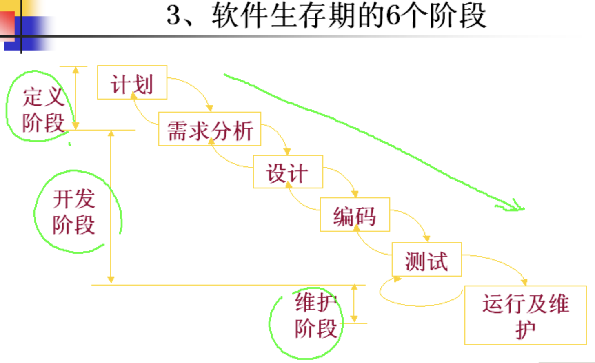

### 生存周期法 的特点

* 阶段具有顺序的依赖性;
* 推出实现的特点;
* 质量保证的观点:
  * 每个阶段都必须完成规定的文档;
  * 每个阶段结束前都要对所完成的文档进行批审, 以便尽早发现问题, 改正错误.

### 软件生存期模型   \(重点\)

* **`软件生存期模型`**  
  * **是从软件项目需求定义直至软件经使用后废弃为止, 跨越整个生存期的系统开发, 运作和维护所实施的全部过程,活动和任务的`结构框架`**
* **有`瀑布模型, 演化模型, 螺旋模型, 喷泉模型` 等**

#### **瀑布模型**

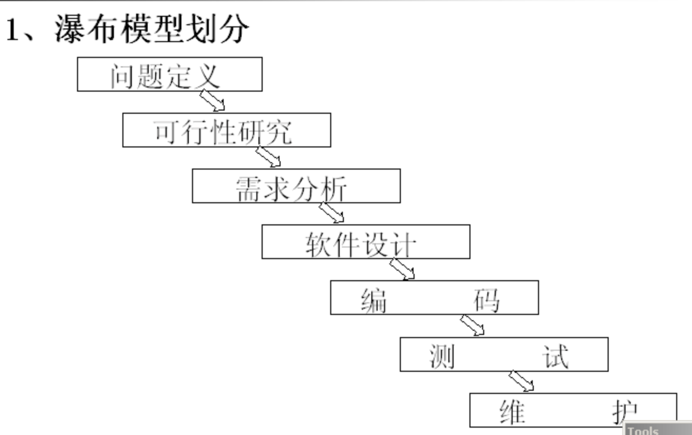

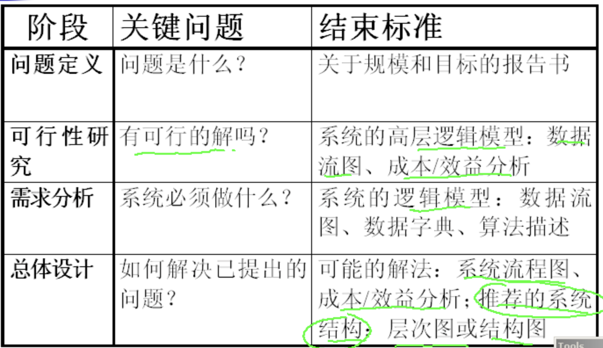

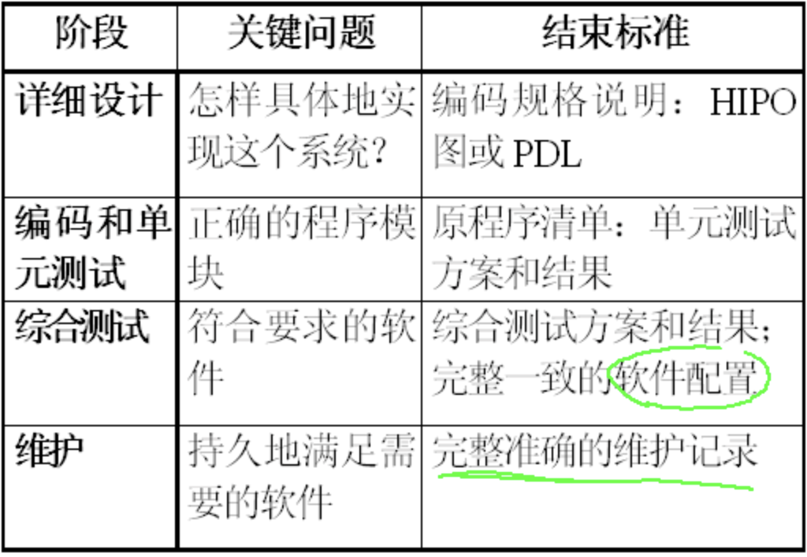

#### 瀑布模型的特点

* **典型瀑布模型具有`顺序性和依赖性`**
  * **以上一项中的结果作为本阶段的输入;**
  * **利用这一输入实施该项活动应完成的内容;**
  * **给出项活动的工作成果, 作为输出传给下一项活动\(阶段\);**
  * **对该项活动实施的工作进行评审.  若其工作得到确认, 则继续下一项活动\(阶段\);**
* **瀑布模型最突出的 `缺点` 是该模型缺乏灵活性.**

**瀑布模型的其他形式**

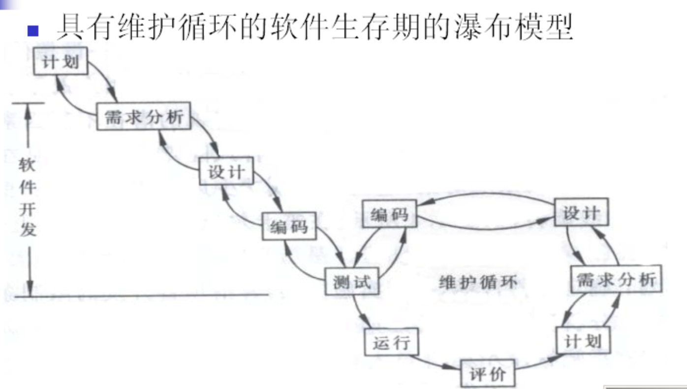

#### 演化模型 中的 原型模型

在获取一组基本的需求定义后,利用高级软件工具的开发环境,**快速建立一个目标系统的最初版本, 并把它交给用户试用,补充和修改,**  再进行**新的版本开发**.  反复进行这个过程, 知道得出系统的 **"精确解"** ,  即用户满意为止.  经过这样的一个反复补充和修改的过程,  应用系统的 **"最初版本"** 就主播演变成为系统的 **"最终版本"**.

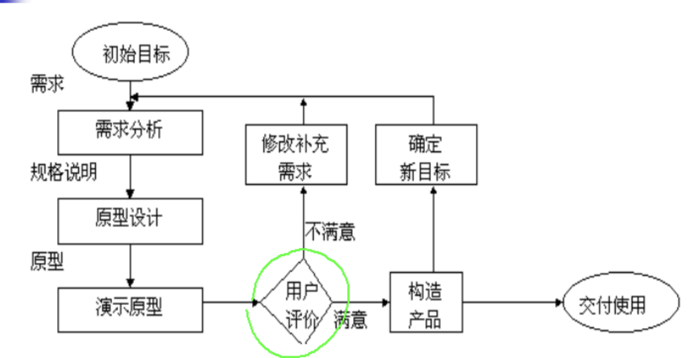

**原型模型特征**

* **它是一个可世纪运行的系统;**
* **他没有固定的生存期.**
* **从需求分析到最终产品都可作为原型,  即可为不同目标作原型;**
* **他必须快速, 廉价;**
* **它是迭代过程的集成部分, 每次经用户评价后修改, 运行, 不断重复 双方认可;**

#### **原型模型的评价**

* **优点:**
  * **原型法在得到良好的需求定义上 比 传统生存期法好得多, 可处理`模糊需求`,  开发者和用户可充分通信;**
  * **原型系统可以作为`培训环境`, 有利于用户培训和开发同步, 开发过程也是学习过程;**
  * **原型系统给用户以机会更该原先设想的, 不合理的系统;**
  * **原型系统可降低风险, 发开柔性较大的计算机系统;**
  * **原型系统增加使系统更易维护, 对用户更优化的机会;**
* **缺点:**
  * **对于开发者不熟悉的`领域把次要部分`当成`主要框架`, 做出不切题的原型;**
  * **原型迭代不收敛于开发者预先的目标.  即每次更改, 为了消除错误, 次要部分越来越大, "淹没" 了主要部分;**
  * **原型过快收敛于需求集合, 而忽略了一些`基本点`;**
  * **资源规划和管理较为困难, 随时`更新文档`也带来麻烦;**
  * **长期在原型环境上开发, 只注意得到满意的原型, 容易 "遗忘" `用户环境`  和`原型的差异;`**

#### **原型法的适用范围**

* **辅助分析和确定用户需求;**
* **作为软件设计的一种工具, 更多的是用来获取用户的需求;**
* **作为一种`解决不确定性问题`的工具;**
* **作为一种`实验工具;`**
* **作为同步培训工具;**
* **"一次性" 的应用;**
* **作为软件维护的辅助工具.  特别是在用户需求不稳定, 维护工作量很大的情况下, 要求大量的`重新设计工作;`**

#### 喷泉模型

* **喷泉模型 认为软件生命周期的各个阶段是相互重叠和多次反复的;**
  *  **`演化, 维护, 确认,  实现,  设计,  分析`**
* **主要用在面向对象方法中;**

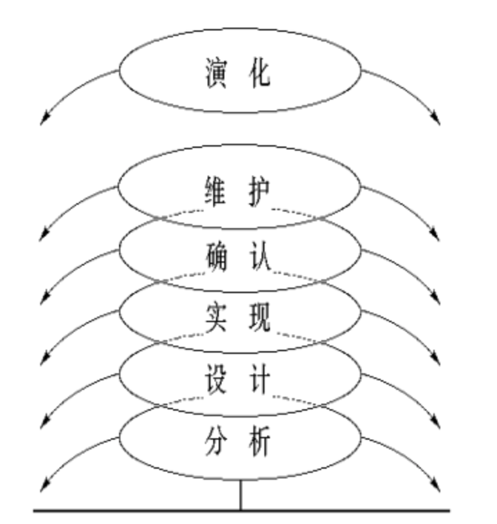

#### 螺旋模型

* 在**原型基础**上, 进行多次原型反复并增加**`风险评估,`**  形成螺旋模型
* **螺旋模型的图形**表示为, 在笛卡尔积坐标的四个象限上分别表达了四个方面的活动, 即:
  * **制定计划** --- 确定软件目标, 选定实施方案, 弄清项目开发的限制条件;
  * **风险分析** --- 分析所选方案,  考虑如何识别和消除风险;
  * **实施工程** --- ****实施软件开发;
  * **客户评价** --- 评估开发工作, 提出修正建议;

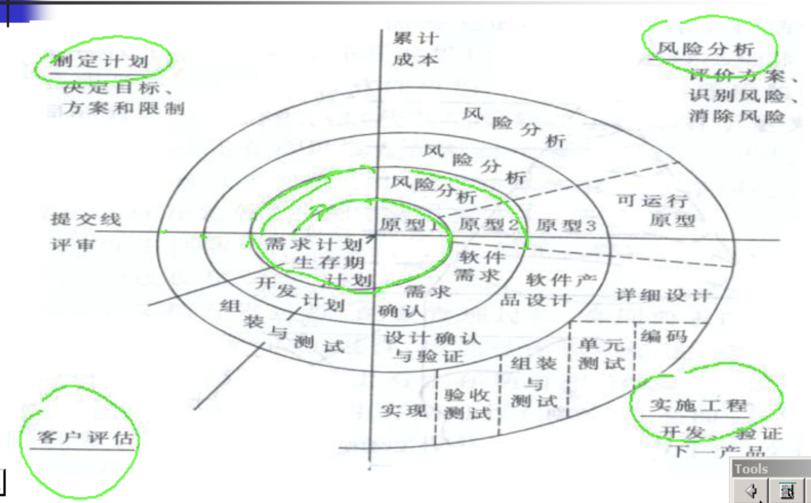

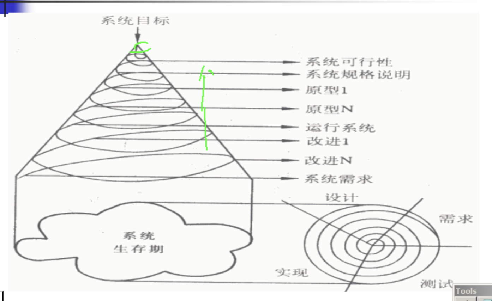

**螺旋模型分析:**

* **在螺旋模型结构中, 维护只是螺旋模型的另一个周期, 在维护和开发之间本质上并没有区别, 从而解决了做太多测试或为作足够测试所带来的风险.**
* **试用条件:**
  * **一般适合于大规模软件的开发**
  * **不太适合 `合同软件`**

