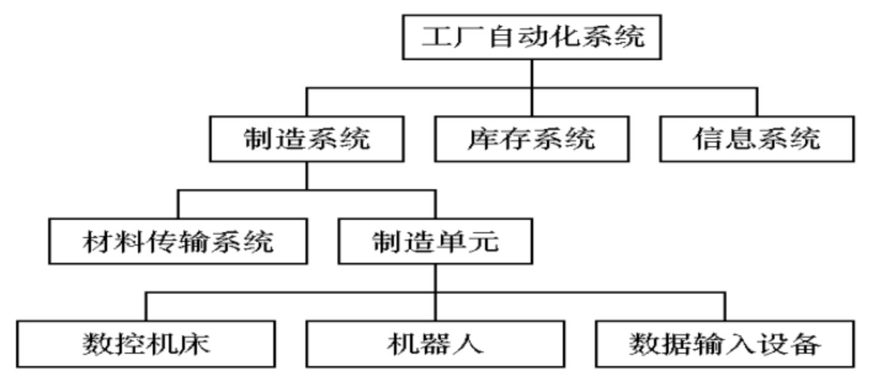
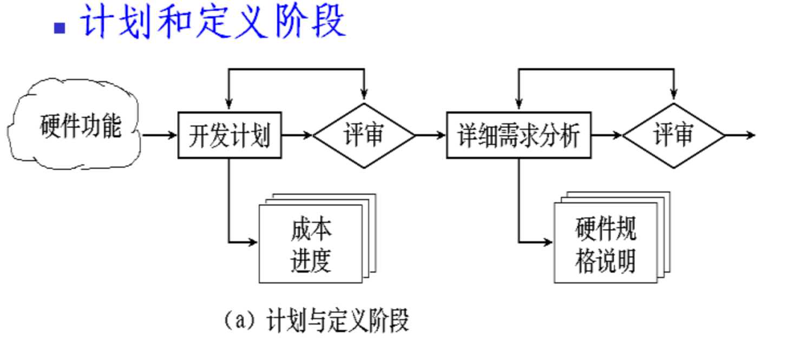
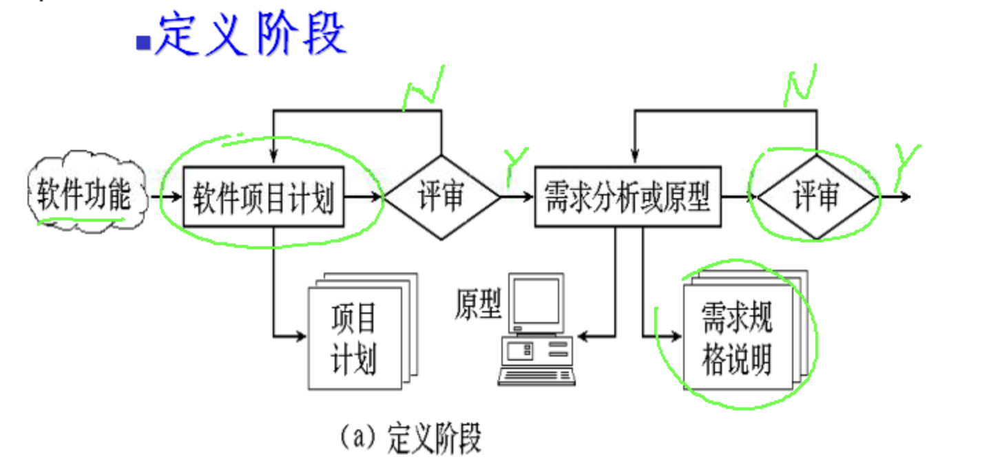
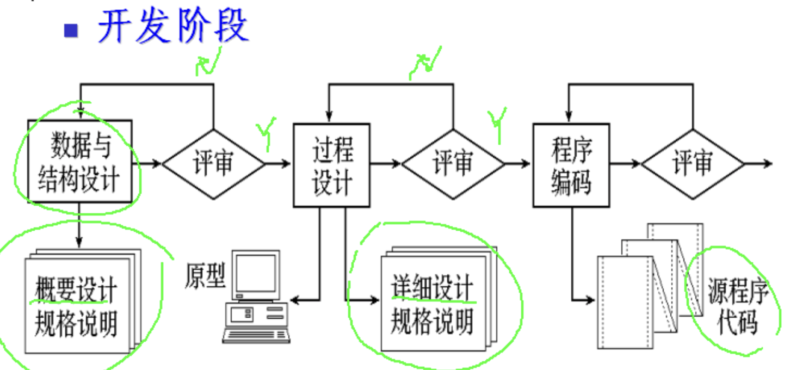

# 系统分析

## 基于计算机的系统

* **某些元素的一个集合或排列;**
* **这些元素被组织起来以实现某种方法, 过程或借助处理信息进行控制.**

### 基于计算机系统的系统元素

* **软件**
  * 计算机程序,  数据结构,  相关文档;
* **硬件**
  * 电子计算设备\(如 CPU, 存储器\)  和外部机电设备 \(传感器, 马达 等\);
* **人**
  * 硬件和软件的用户
* **数据库**
  * 一个大型的有组织的信息集合
* **文档**
  * 手册 , 表格 和 其他用以描述系统使用和操作的信息
* **过程**
  * 定义每一种系统元素的**`特定使用步骤`**, 或系统驻留的过程性环境

### 工厂自动化系统

## 计算机系统工程

计算机系统工程是一个 **`问题求解活动`**,  目的是**`揭示, 分析`** 所期望的功能,  并把它们分配到各个单独的系统元素中去.

### 系统工程师的任务

* 与用户合作确认 **用户的目标和约束;**
*  **`导出功能, 性能, 接口, 设计约束 和 信息结构的 表示;`**
* 将他们分配到每一个系统元素中;

### 硬件和硬件工程

* 计算机系统工程师  **`选择硬件的某种组合`** 以 **`构成基于计算机系统的硬件元素`**
* 硬件工程过程可分为三个阶段
  * **`计划和定义阶段;`**
  * **`设计和样机实现阶段;`**
  * **`生产, 销售和售后服务阶段.`**

#### 计划和定义阶段

#### 设计和样机实现阶段

#### 生产, 销售和售后服务阶段

### 软件与软件工程

* **为实现要求的功能和性能, 必须制作或获取一系列软件部件;**
* **软件工程过程可分为三个阶段**
  * **`定义阶段;`**
  * **`开发阶段;`**
  * **`检验, 交付与维护阶段.`**

### 人与人类工程

* **是应用心理学和方法论 导出的知识来确定和设计`高质量人机对话界面 (HCI)`  的多学科活动.**
* **人类工程过程包括如下步骤**
  * **`活动分析`  ---  环境交互及划分任务, 进行任务分析;**
  * **`语义分析和设计` ---  动作精确定义, `对话`设计.**
  * **`语法和词法设计` --- 各个动作和命令的形式, 硬件与软件实现;**
  * **`用户环境设计` ---  将硬件, 软件和其它系统生成元素组合起来形成用户环境;**
  * **`原型` ---  从人的角度出发来评价 界面\(HCI\);**

### 数据库和数据库工程

* **数据库工程 \( `包括数据分析, 设计 和 实现`**\);
* **对于使用数据库的系统,  `信息仓库 往往是所有功能的核心;`**
* **数据库工程的应用是在数据库的信息域定义完成之后;**

## 系统分析的目标和过程

## 可行性研究

## 成本 和 效益分析

