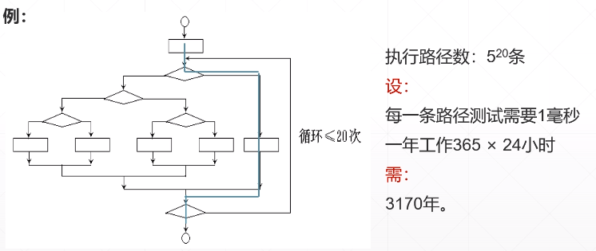

# 需求分析

## 需求分析的任务

* **基本任务:**
  * 准确的回答 "系统必须做什么?"
* **借助于`当前系统的逻辑模型`导出`目标系统的逻辑模型`,解决目标系统的"`做什么`"的问题.**

###    需求工程中存在的困难

* **误解;**
* **完整性问题; \(完整的获取用户需求, 完整的叙述问题\)**
* **需求不稳定;**
* **用户意见不统一;**
* **错误的要求;**
* **认识的混淆;**

### 获取需求得两条原则

* **第一 ,  只有当你彻底弄懂了用户的`全部意图之后`, 才有可能建立起`成功的软件系统;`**
* **第二,  一切从用户角度着想, 在条件\( 人力,物理,财力和技术力量等\)  允许的情况下尽可能保证用户从所构造的软件系统中获得最大利益;**

### **需求分析的过程**

* **确定对系统的综合需求:**
  * **`1.系统功能要求,   2.系统性能要求,   3.运行要求,   4.将来可能提出的要求.`**
* **分析系统的数据要求;**
* **导出系统的逻辑模型:**
  * **`数据流程图,  数据字典,  主要算法`**
* **修正系统开发计划;**
* **开发原型系统;**

## 需求分析的过程

### **问题识别**

**从系统的角度来理解软件并评审软件范围是否恰当.**

* **确定对目标系统的综合要求, 即软件的需求;**
* **提出这些需求实现条件, 以及需求应达标的标准;**
* **建立分析所需要的通信途径;**

### 软件需求包括内容

*  **软件的需求包括:**
  * **`功能需求;`**
  * **`性能需求;`**
  * **`环境需求;`**
  * **`可靠性需求;`**
  * **`安全保密要求;`**
  * **`用户界面需求;`**
  * **`资源使用需求;`**
  * **`成本消耗需求;`**
  * **`开发进度需求;`**
  * **`预先估计以后系统可能达到的目标;`**
* **建立分析所需要的通信途径, 以保证能顺利的对问题进行分析.**

### 分析与综合

 **从`信息流` 和`信息机构`出发,  `逐步细化所有的软件功能`,  找出`系统各元素之间的联系, 接口特性和设计上的约束`,  分析它们是否满足功能要求, 是否合理.  剔除其不合理的部分, 增加其需要部分. 最终 总合成系统的解决方案,  给出** 目标系统的详细逻辑模型.

### **常用的分析方法**

* **面向数据流的 `结构化分析方法(SA);`**
* **面向数据结构的** **`Jackson方法(JSD);`**
* **面向对象的`分析方法(OOA)等;`**

### 编制需求分析阶段的文档

* **软件需求说明书;**
* **数据需求说明书;**
* **初步的用户手册;**
* **修改, 完善与确定软件开发实施计划.**

###  **需求分析评审**

* **系统定义的目标是否与用户的要求一致;**
* **系统需求分析阶段提供的文档资料是否齐全;**
* **文档中的所有描述是否 完整, 清晰, 准确 的反映用户的要求;**
* **与所有其他系统成分的重要接口是否都已经描述 ;**
* **被开发项目的数据流与数据结构是否足够, 确定;**
* **所有图标是否清楚,  在不补充说明时 能否理解;**
* **主要功能是否已包括在规定的软件范围之内, 是否都已充分说明.**
* **设计的约束条件或限制条件是否符合实际;**
* **开发的技术风险是什么;**
* **是否考虑过软件需求的其他方案;**
* **是否考虑过将来可能提出的软件需求;**
* **是否详细指定了检验标准, 他=它们能否对系统定义成是否成功进行确认;**
* **有没有遗留, 重复 或 不一致的地方;**
* **用户是否伸长了初步的用户手册;**
* **软件开发计划中的估算是否受到了影响;**

### 需求分析的具体流程

## 软件需求分析的原则

### 软件需求分析方法的共同原则

* **需要能够表达和理解问题的`信息域和功能域.`**
* **要能以层次化的方式对问题进行`分解和不断细化(自顶向下逐层分解);`**
* **要给出系统的`逻辑视图` 和`物理视图;`**

## 结构化分析方法\(SA\)   \(重点\)

**`数据流图必须和数据词典一起使用, 否则会出现二义性;`**

* **具体来说,  结构化分析方法就是用 `抽象模型` 的概念, 按照软件内部 `数据传递, 变换` 的关系, `自顶向下逐层分解`, 知道找到满足功能要求的可实现的软件为止;**
* **采用面向数据流进行需求分析的方法;**
* **结构化分析方法适合于数据处理类型软件的需求分析.**

### 结构化分析方法使用工具

* **`数据流图;`**
* **`数据词典;`**
* **`结构化语言;`**
* **`判定表与判定树.`**

### 数据流图 \(DFD\)

**数据流图从 `数据传递`和`加工的角度,` 以图形的方式刻画`数据流`从输入到输出`移动变换`过程.**

* 数据流图中的主要图形元素:
  * 数据加工\(数据变换\) ;   
  * 数据源点 或 终点\(外部实体\);   
  * 数据流;    
  * 数据存储文件;    

### 数据流与数据加工之间的关系

### 数据流图绘制步骤

#### 例1: 对商店业务处理系统:

* **首先确定系统的输入和输出.**
  * **根据商店业务画出顶层数据流图, 以反映`最主要`业务处理流程.**

#### 高层逻辑模型图

* 经过分析, 商店业务处理的**主要功能** 应当有**`销售, 采购, 会计`** 三大项.  **主要数据流输入的源点**和**输出终点**是**顾客**和**`供应商`**.
* 然后从输入端开始, 根据商店业务工作流程, 画出数据流  流经的各加工框, 逐步画到输出端,  得到第一层数据加工流图.

#### 第一层数据流图

* **细化每一个加工框** - **`销售细化`**

* **细化每一个加工框 - `采购细化`**

### 检查和修改数据流图

* **数据流图上所有图形符号 `只限于 前述的四种基本图形元素;`**
* **`数据流图的主图必须包括前述四种基本元素, 缺一不可;`**
* **`数据流图的主图上的数据流必须封闭在外部实体之间;(输入输出,或源点)`**
* **每个加工`至少有一个输入数据流和一个输出数据流;`**
* **在数据流图中, 需`按层给加工框编号`,  编号表名改加工所处层次以及上下层的亲子关系;**
* **规定任何一个数据流子图 必须 与他上一层的一个加工`对应,` 两者的输入数据流和输出数据流必须一致.  `此即父图与子图的平衡;`**
* **可以在数据流图中加入物质流,  帮助用户理解数据流图;**
* **图上每个元素都必须有名字;**
* **数据流图中 `不可夹带控制流;`**
* **初画时可以忽略琐碎的细节,  `以集中精力与主要数据流`.**

\*\*\*\*

### 数据词典  \(DD\)

* **`数据字典`是关于`数据的信息集合`,  也就是对数据流图中包含的所有元素的定义的集合.**
* **`数据字典的任务是对数据流图中出现的所有被命名的图形元素的名字都有一个确切的解释;`**
* **`数据词典与数据流图配合`, 能清楚地表达数据处理的要求.**

\*\*\*\*

\*\*\*\*

## 数据及数据库需求

